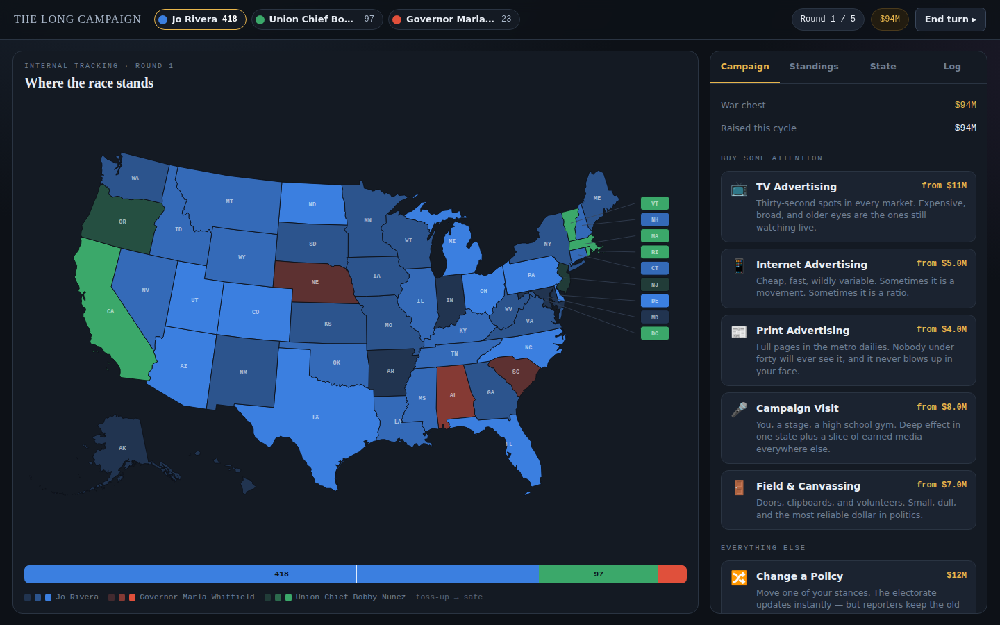

# THE LONG CAMPAIGN

A presidential campaign simulator that runs entirely in a browser. No build step, no server, no
network — open `index.html` and play.



## Running it

```bash
git clone <this repo> && cd election-game
python3 -m http.server 8000     # or any static server
# then open http://localhost:8000
```

Opening `index.html` directly from disk also works.

## What the game is

You write a biography, take positions on the five issues that happen to define this cycle, and then
spend a war chest trying to move fifty-one separate electorates. Between rounds you get a poll. At the
end you get an election night, revealed state by state from east to west.

You can play against AI opponents, or hand the device back and forth between two or more humans.

## The model

### The electorate

Every state gets **100 simulated voters**. Each is assigned an age band (18–34 / 35–64 / 65+) and a
gender (men / women / nonbinary) drawn from that state's demographic mix. Those three things — **state,
age, gender** — are the three voter dimensions.

Each state, each age band and each gender carries its own ideology profile across three axes (social,
economic, national). A topic's stance for a group is that profile projected onto the topic's axis
weights and scaled to **−3 … +3**. A voter's own position on an issue is the **average of their three
group positions** plus individual noise.

Older voters turn out more reliably than younger ones, so each simulated voter carries a weight —
a vote won among the over-65s is worth more actual ballots than one won among the under-35s.

### How a vote is decided

- **Voter vector** = `[issue₁ … issue₅, bias→candidate₁ … bias→candidateₙ]`
- **Candidate vector** = `[stance₁ … stance₅, +3 in their own slot, −3 in every rival's]`

The voter picks whichever candidate gives the **highest cosine similarity**.

Cosine compares *direction*, not distance, and that has consequences the game leans on: a candidate
who holds no position on anything points nowhere and is nobody's best match, while a candidate pointed
confidently the wrong way loses too. Standing for nothing beats standing for the wrong thing, and
loses to almost everything else.

### Biases

Every voter starts with a bias toward each candidate, seeded by the **pundit engine's** read of that
candidate's biography — a local lexicon-and-style analyser, not a call out to a language model, since
the game runs offline. Advertising pushes those biases around for the rest of the campaign.

### The campaign

| | reaches | notes |
|---|---|---|
| **TV** | skews old | expensive, broad, low variance |
| **Internet** | skews young | cheap, enormous variance, ratio-able |
| **Print** | almost nobody, mostly old | never blows up in your face |
| **Campaign visits** | one state, hard | plus a slice of earned media everywhere |
| **Field & canvassing** | one state, steadily | the most reliable dollar in politics |

Plus policy changes, celebrity endorsements, the donor circuit, opposition research, and — in one
funding mode — corporate money.

Every action has **diminishing returns** (the fourth identical buy does about a third of what the
first one did) and can **backfire**. You are never told the number you moved; you are told what
happened, the way a campaign manager would tell you.

Ads can be aimed at a demographic slice, which doubles the effect on that slice and nearly erases it
everywhere else, and can be run **for** you or **against** a rival (attacks splash back a little).

### Authenticity

Your biography implies positions. Running against them is allowed, and it costs you: only the issues
your story actually spoke to are counted, and a platform nobody believes makes everything your
campaign does land up to 30% weaker.

### Polling

The map during the campaign is your **internal tracking**: the truth plus a noise field that is fixed
for the round, so the map moves when you move it rather than jittering. The published poll between
rounds is noisier and tightens as election day approaches. On election night the real numbers arrive,
jittered one last time — and the final screen shows how wrong the last poll was.

### Money

Three modes, chosen at setup:

- **Level playing field** — everyone gets the same amount every round.
- **The luck of the draw** — everyone draws a different amount every round.
- **Money with strings** — smaller budgets, but industries are offering cheques. Take one and your
  position on their issue becomes theirs, permanently. If you win with their money behind you, the
  epilogue says exactly what they bought.

After the last scheduled round comes a **final push**: no new money, just whatever is left.

## Layout

```
index.html          markup and the how-it-works page
css/style.css       everything visual
js/usmap.js         generated Albers-USA paths (from us-atlas, simplified)
js/data.js          states, demographics, topic pool, actions, celebrities, corporations, AI archetypes
js/analyst.js       the pundit engine — biography → foundational appeal
js/sim.js           electorate construction, cosine voting, the count, polling noise
js/engine.js        campaign actions, outcomes, random events, AI opponents
js/ui.js            map rendering and shared display helpers
js/main.js          game state, screen flow, every panel
```

## Notes on the numbers

State electoral votes are the real 2024–2030 apportionment (538 total, 270 to win, winner-take-all in
every state including Maine and Nebraska). Population and demographic splits are approximations chosen
to feel right, not census figures. State ideology profiles are hand-assigned to roughly track how each
state actually votes — the swing states that fall out of the simulation are the ones you would expect.

Everything else — candidates, corporations, celebrities, events — is invented.
